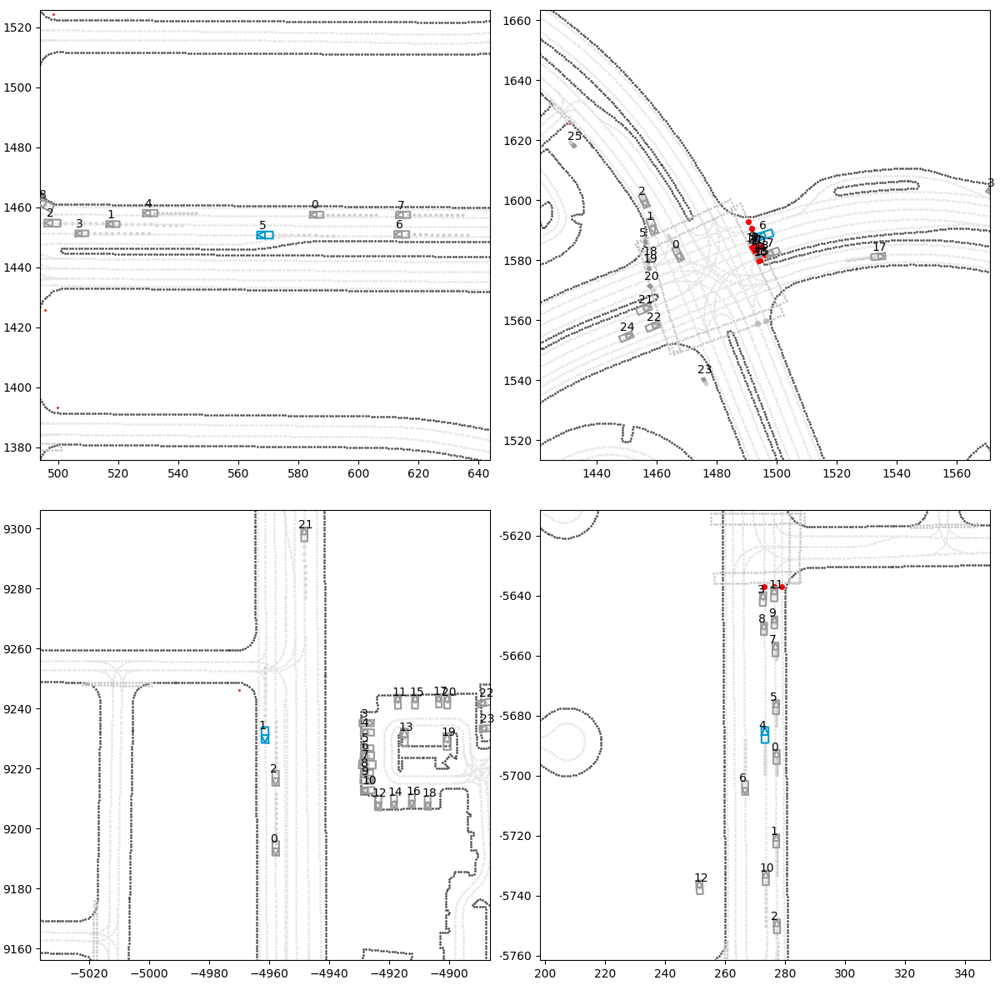

# Diffusion-Trajectory-Forecaster
Train Diffusion Trajectory Forecaster model using the Waymo Motion dataset  for  mmls hse project

### Install Dependencies
To create env and install dependecies:
```
conda create -n diffusion_tracker python=3.10
conda activate diffusion_tracker
pip install uv
uv sync
```
To authenticate to google account for data downloading(one time):

1. Apply for [Waymo Open Dataset](https://waymo.com/open) access.
2. Install [gcloud CLI](https://cloud.google.com/sdk/docs/install)
3. Run ```gcloud auth login <your_email>``` with the same email used for step 1.
4. Run ```gcloud auth application-default login```.

### Data predownload
If you want to download specific path from waymax (Motion)[https://waymo.com/open/download/] dataset run:
```
mkdir -p ./data/training
gsutil -m cp -r gs://waymo_open_dataset_motion_v_1_3_1/uncompressed/tf_example/training ./data/training
or
```
```
mkdir -p ./data/training
gsutil cp gs://waymo_open_dataset_motion_v_1_3_1/uncompressed/tf_example/training/training_tfexample.tfrecord-00000-of-01000 ./data/training/

```

### Data visulization
 To run visualization
```
uv run visualise_data.py
```

### Metrics used
####  Overlap (Collision Rate)

Shows fraction of time during which ego vehicle’s bounding box overlaps with any other object.

#### Offroad Rate

Shows fraction of time during which the ego vehicle leaves the drivable road area.

#### Log Divergence (ADE)

Log divergence measures how far the simulated trajectory deviates from the logged (ground-truth) trajectory over time.

### Example



#### log_divergence: 60.71818017959595

#### offroad: 0.25

#### overlap: 0.75
